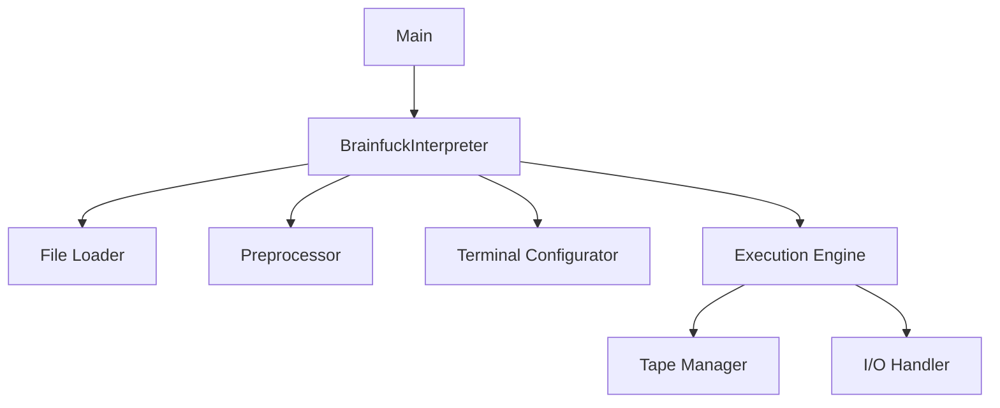

# Advanced Brainfuck Interpreter

A high-performance, feature-rich Brainfuck interpreter written in modern C++. Designed for efficiency, correctness, and Unix-like system integration.

## Features

- **Bidirectional Infinite Tape**: Implements dynamically expanding memory in both directions using twin vectors
- **Optimized I/O Handling**:
  - Buffered output with 8KB chunk flushing
  - Raw terminal input mode for single-character reading
  - Input echo suppression during `,` operations
- **Advanced Preprocessing**:
  - Jump table construction during initialization
  - Full syntax validation (bracket matching)
  - Automatic code filtering (ignores non-BF characters)
- **Memory Safe**:
  - Strict bounds checking on tape access
  - Proper terminal state restoration
- **Error Handling**:
  - File I/O errors
  - Syntax errors (unmatched brackets)
  - Terminal configuration failures

## Installation

### Requirements
- C++17 compatible compiler (GCC 10+ or Clang 12+)
- GNU Make 4.0+
- Unix-like system (Linux/macOS/WSL)

### Build Instructions
```bash
git clone https://github.com/CalestialAshley35/bf-interpreter.git
cd bf-interpreter
make optimized  # Builds with -O3 -march=native
```

### Verification
Validate the build with:
```bash
make test  # Runs basic test suite
```

## Usage

### Execution Format
```bash
./interpreter bf run <filename.bf> [--unsafe]
```

| Flag       | Description                                  |
|------------|----------------------------------------------|
| `--unsafe` | Disables input validation for raw byte reads |

### Operational Characteristics
- **Memory Model**: 8-bit cells (unsigned char)
- **Tape Structure**:
  - Right-expanding vector (positive addresses)
  - Left-expanding vector (negative addresses)
  - Automatic zero-initialization on access
- **Cycle Limits**: None (implementer's responsibility for halting)

## Example Session

### Sample Program (helloworld.bf)
```brainfuck
++++++++[>++++[>++>+++>+++>+<<<<-]>+>+>->>+[<]<-]>>.>---.+++++++..+++.>>.<-.<.+++.------.--------.>>+.>++.
```

### Execution
```bash
./interpreter bf run helloworld.bf
Hello World!
```

## Implementation Details

### Architecture Overview


### Key Components

1. **Jump Table Construction**:
   - O(n) time complexity using stack-based bracket matching
   - Full validation during initialization
   - Direct IP redirection during execution

2. **Terminal Management**:
   ```cpp
   struct termios {
     tcflag_t c_lflag;  // Local modes
     cc_t c_cc[NCCS];   // Control chars
   };
   ```
   - Raw mode activation on `,` presence detection
   - Signal-safe restoration via RAII destructor

3. **Memory Access Pattern**:
   ```cpp
   accessCell(int dp, vector<uchar>& right, vector<uchar>& left) {
     return dp >= 0 ? right[dp] : left[-dp - 1];
   }
   ```
   - O(1) access with automatic expansion
   - Negative address translation via two's complement

## Performance Characteristics

| Operation        | Time Complexity | Space Complexity |
|------------------|-----------------|------------------|
| Initialization   | O(n)            | O(n)             |
| Cell Access      | O(1)            | O(1)             |
| Loop Handling    | O(1) per jump   | O(n) prealloc    |
| I/O Operations   | O(1) amortized  | O(1) buffer      |

## Troubleshooting

### Common Issues

**Build Failures**:
```bash
# If missing dependencies:
sudo apt install build-essential  # Debian/Ubuntu
brew install make                 # macOS
```

**Input Handling**:
- Use `--unsafe` flag for binary input
- Ensure terminal supports termios (WSL requires winpty)

**Error Messages**:
```
Error: Unmatched ']' at position 42
```
- Validate bracket pairing with:
  ```bash
  grep -o '[\[\]]' program.bf | tr -d '\n' | sed 's/\[\]/<>/g'
  ```

## License
GNU General Public License v3.0-or-later - See [LICENSE](LICENSE) for full text.

## Contributing
1. Fork repository
2. Create feature branch
3. Submit PR with:
   - Updated tests
   - Documentation changes
   - Benchmark results